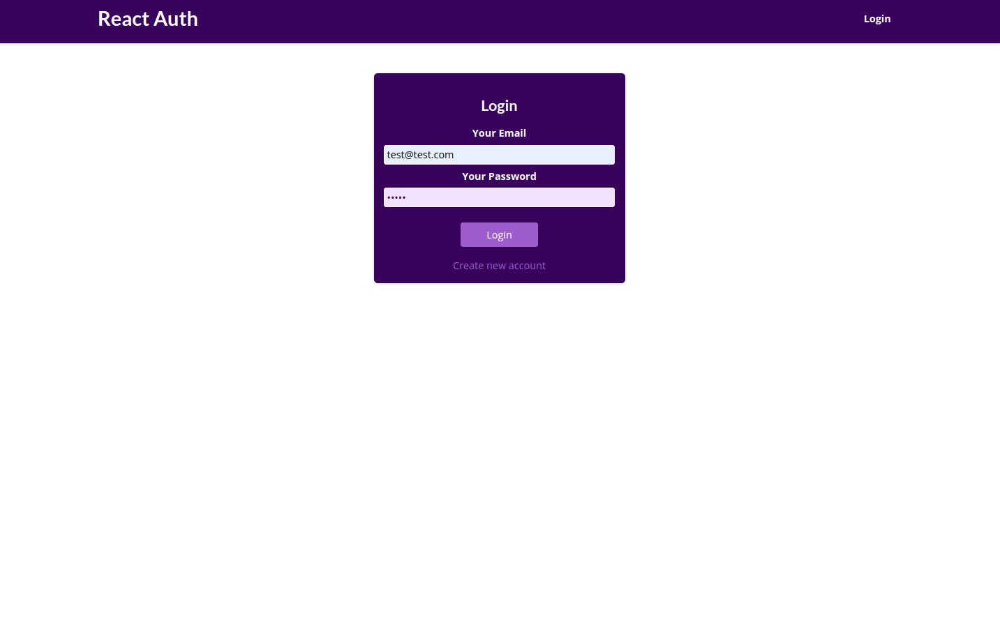
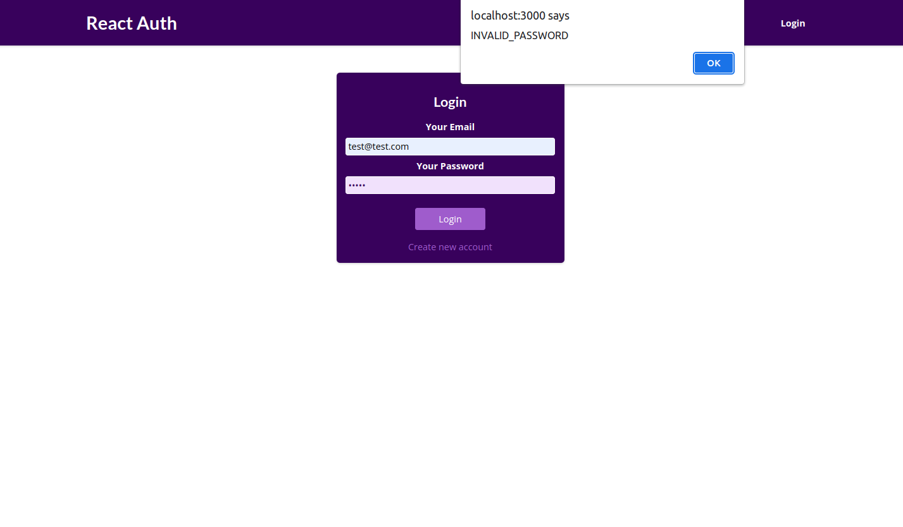
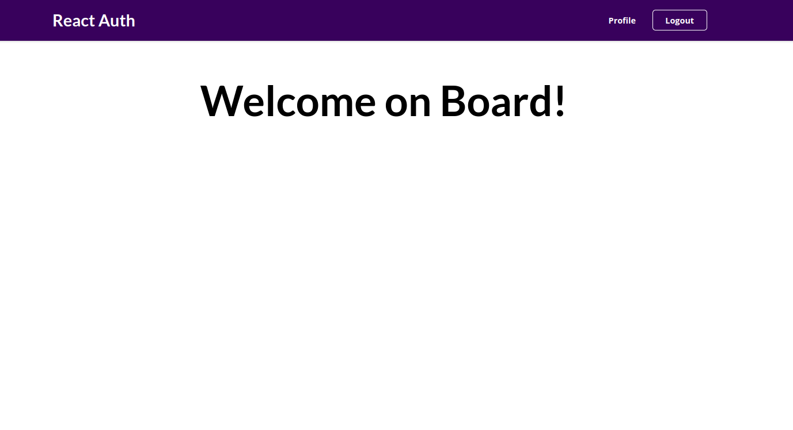
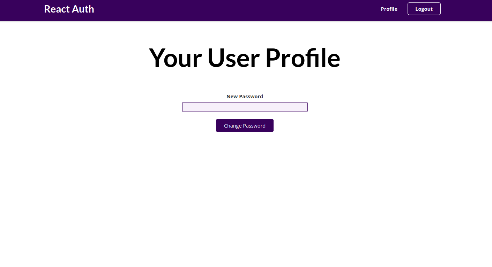

# Authention

## Summary

This is a practice for safe authentication using Firebase Auth REST Api.

## Demo

### Main page

Login to your account.

### Prevent inavlid input

### Login

The user stays logged in even if they reload the page. 

### Change Password

