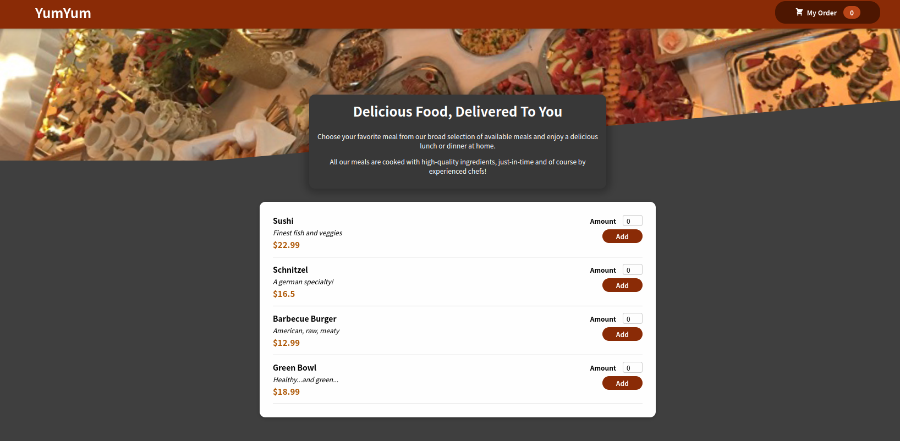
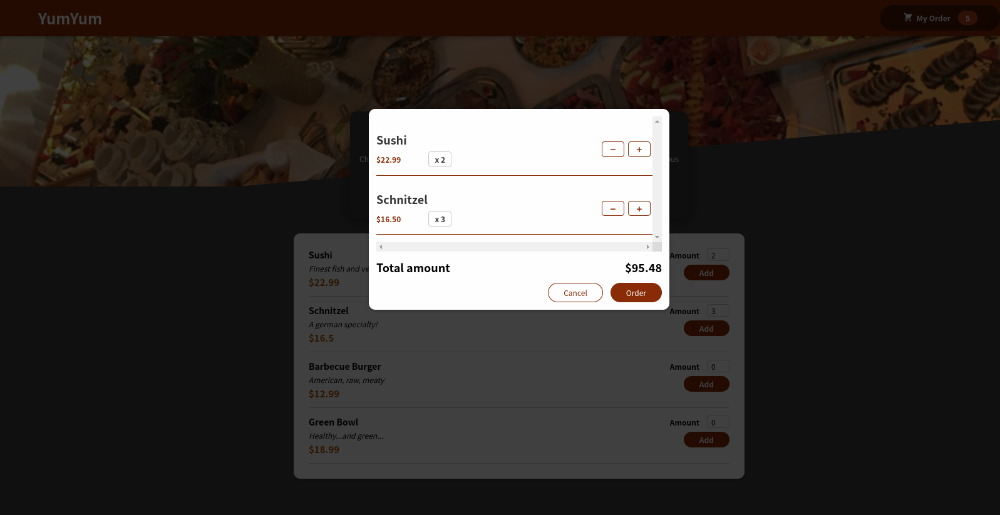

# Food_Menu

This project's purpose is to practice Hooks in React.js. It is a simple food ordering page with the ability of adding orders to the cart, editing the cart and some minor animations when adding an item to the cart. This repository has been done along with one of the assignemnets presented in [React - The Complete Guide (incl Hooks, React Router, Redux)](https://www.udemy.com/course/react-the-complete-guide-incl-redux/) course. 

# Demo

## Main page

## Cart visuals

 