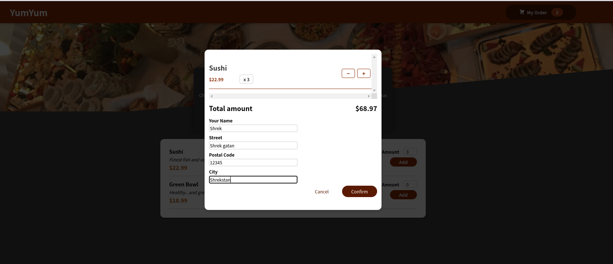
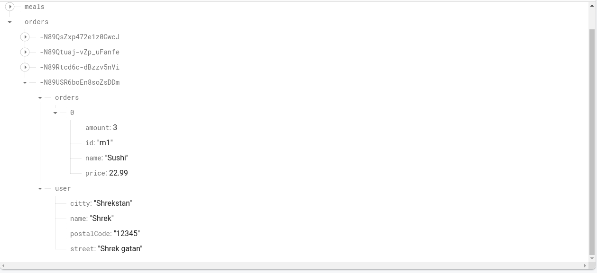

# Food_Menu

This project's purpose is to practice Hooks in React.js. It is a simple food ordering page with the ability of adding orders to the cart, editing the cart, saving user information and the order to a firebase db, and some minor animations when adding an item to the cart. This repository has been done along with the assignemnets presented in [React - The Complete Guide (incl Hooks, React Router, Redux)](https://www.udemy.com/course/react-the-complete-guide-incl-redux/) course. 

# Demo

## Main page

## Cart visuals

 

## Take an order

 

## Store the order in the DB

 