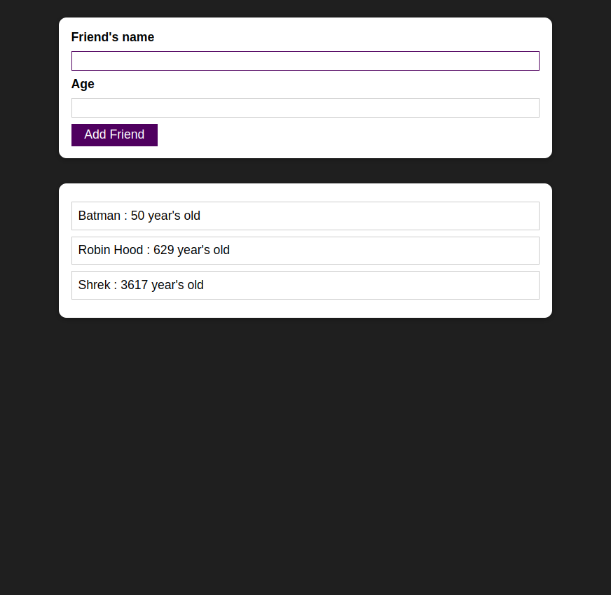
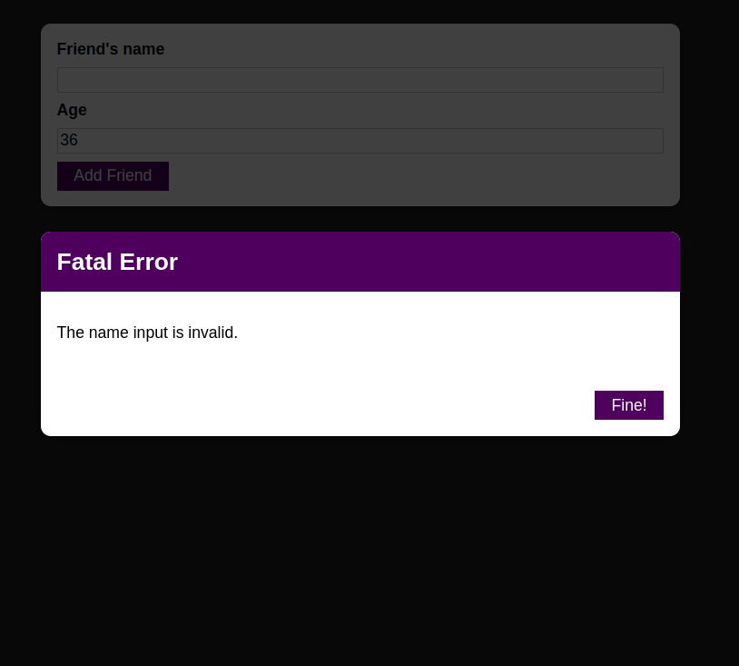
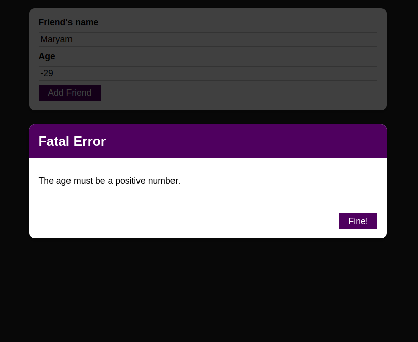

# Friend_Reminder

This repository is a simple practice for React.js. The main objective is to create reusable components and practice passing data from parent components to children and vice versa. The functionality is to save "name" and "age" of your friends in a list in case you've got amnesia...! 

# Demo

## Main Page

## Errors

