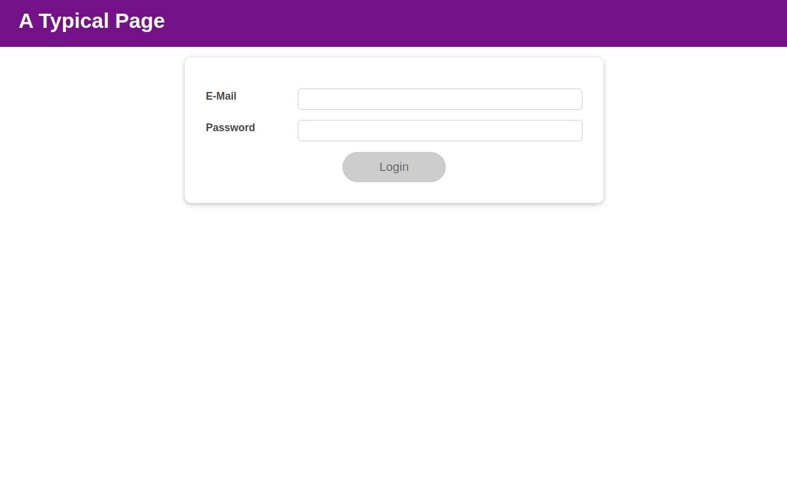
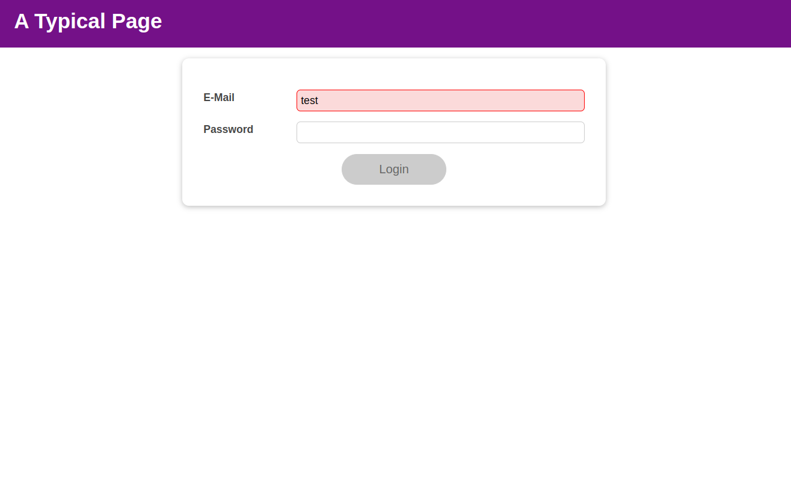
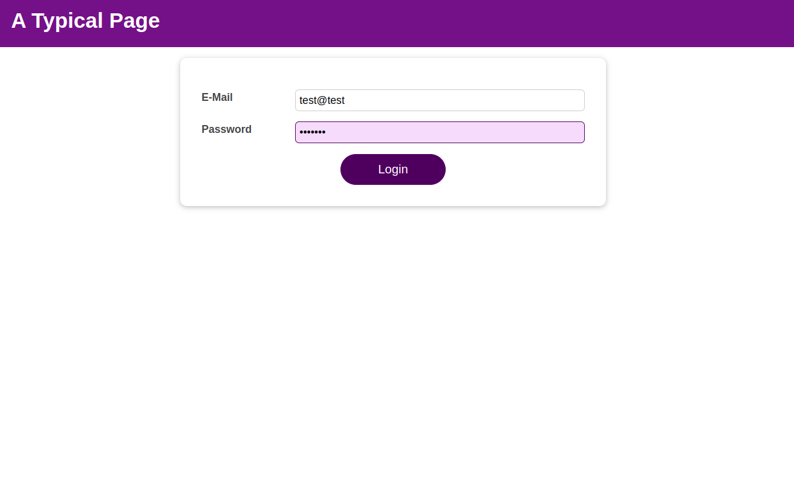
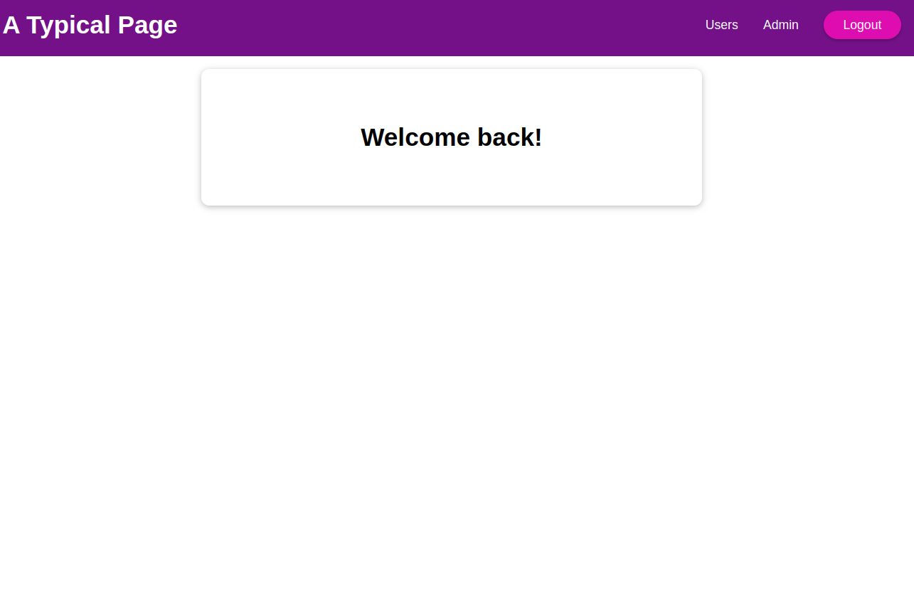

# react_learn_2
This repository is dedicated to practice the concept of Hooks in react. More especifically, the Hooks "useEffect, useState, useReducer, useContext" have been used in a simple login page. The basic codes are taken from [React - The Complete Guide (incl Hooks, React Router, Redux)](https://www.udemy.com/course/react-the-complete-guide-incl-redux/).

# Demo

## Home Page

## Wrong Input

## Correct Input

## Logged In

