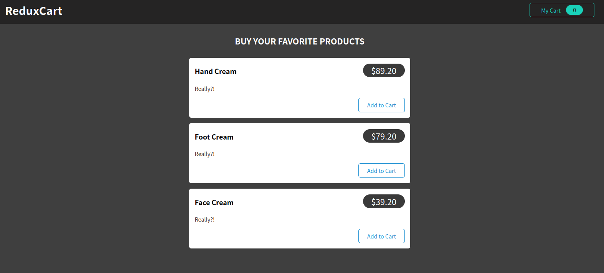
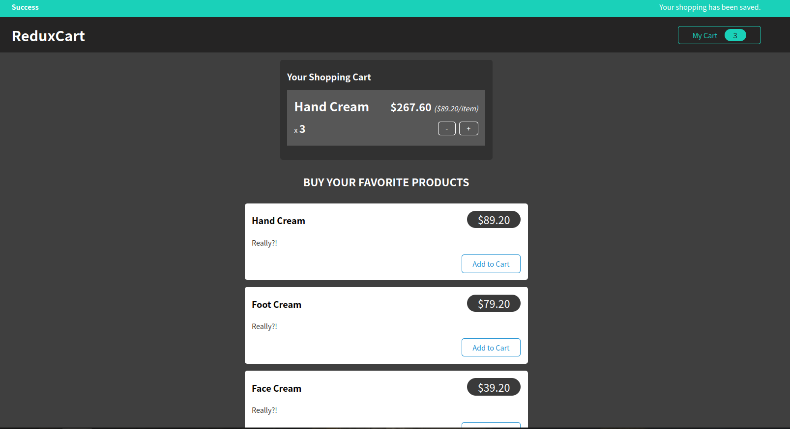
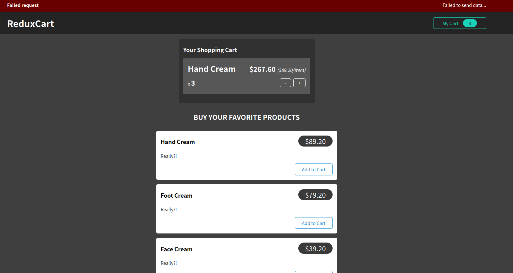
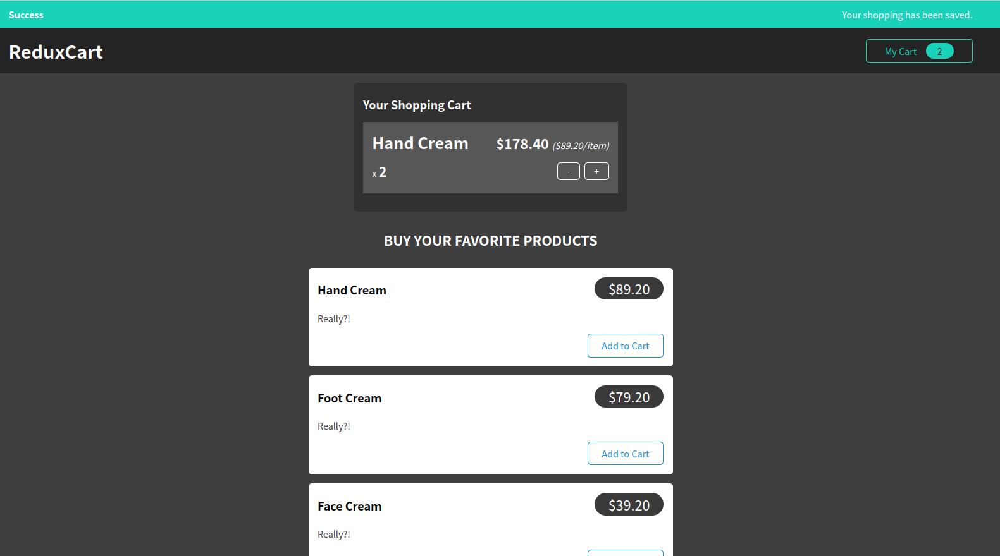
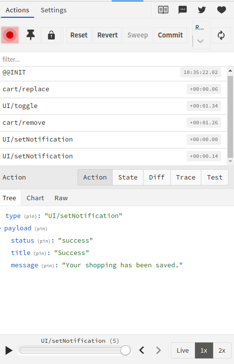

# REDUX advance

## Introduction 

This repository contains the code of a simple single page shopping app using redux to tranfer data between different components. The cart data is sent and fetched from a fire base data base via http requests. 

## Demo

### Main appearance

### Save data successfully 

### Unsuccessful attempts

### Remove items from the cart

### A peek into redux devtool

