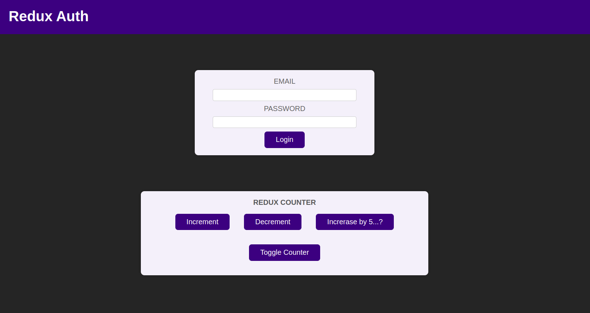
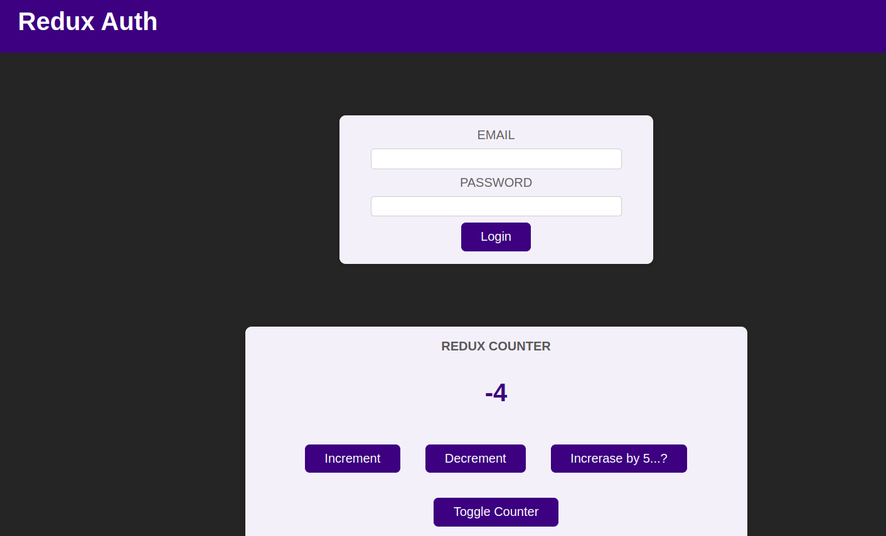
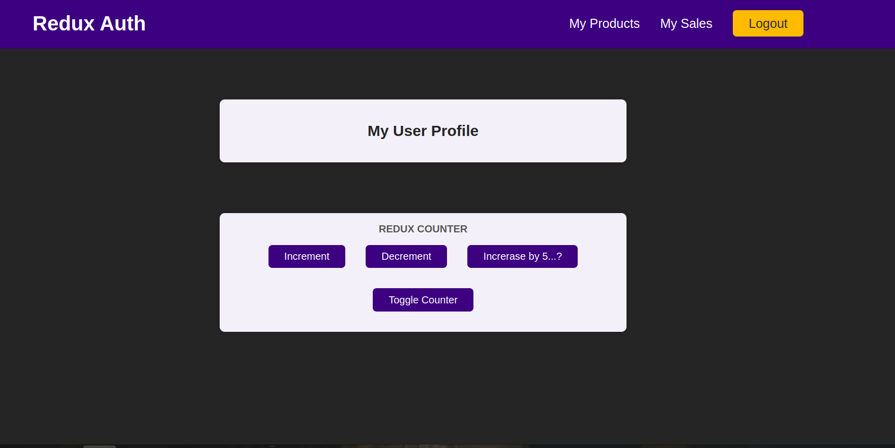

# Redux Practice

## Introduction

This repo is mainly about learning redux basics. there is a single web page in which the bottom part is to practice passing propeties of a simple counter using redux reducers. The above part of the page is a simple loging form which is not connected to the counter in anyway! The authentication is done using redux toolkits and the navigation bar above changed according to the authentication status. 

## Demo

### Main Page 

### Counter

### User Logged in

