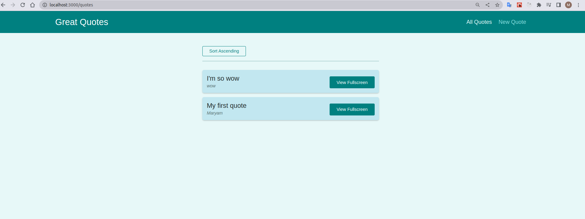
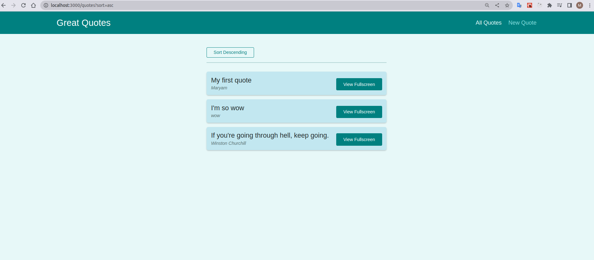
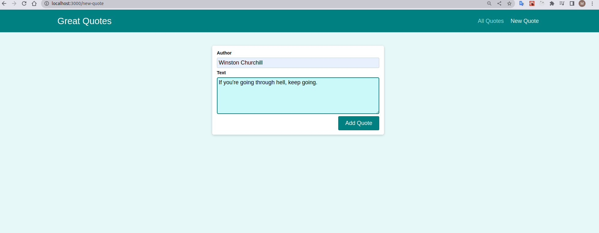
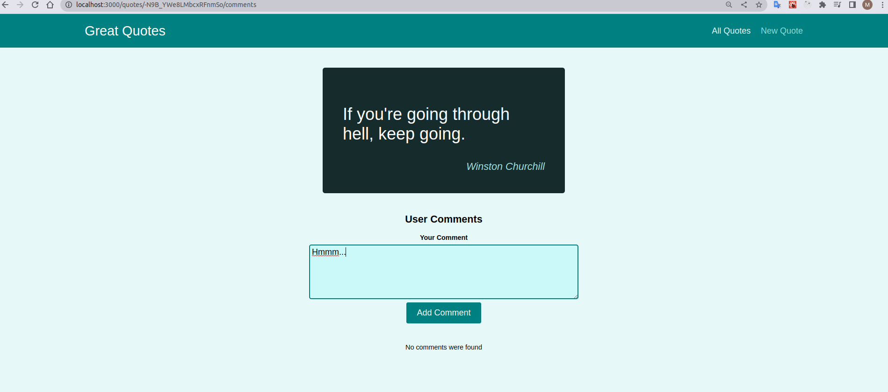
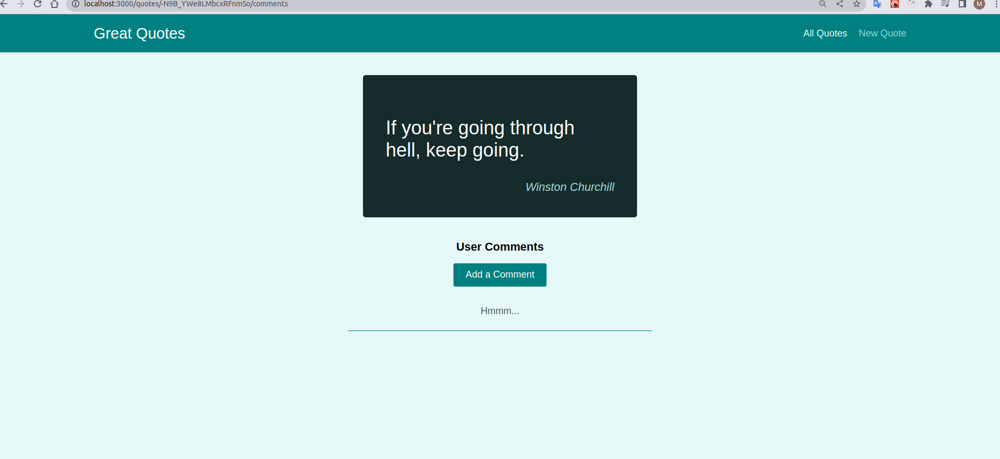

# Quote viewer

## Summary

This application is designed to save and view quotes using firebase db and react router V5. The users can save quotes, sort them and add comments to each individual quote. There are also prompts and some error handlings to prevent from submitting irrelevant data and/or losing users' information accidentally. 

## Demo

The application can be visited in [here](https://tasks-52028.web.app/quotes).

### Overal view

See a list of all the quotes and sort them in ascending/descending manner. 

### Add new quote

Add the quotes from impressive people in your life and take a look at them every day!

### Express yourself!

Show YOUR point of view about other's opinion to the world. Find your own pals by checking out other's similar commenst!

